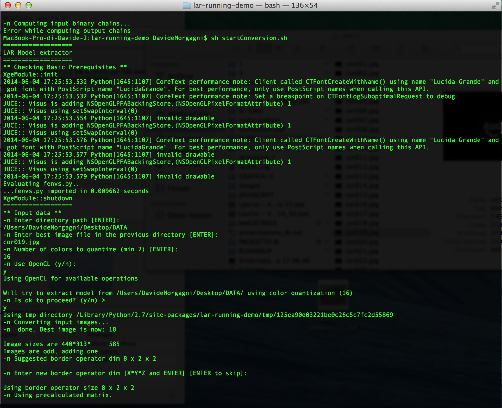
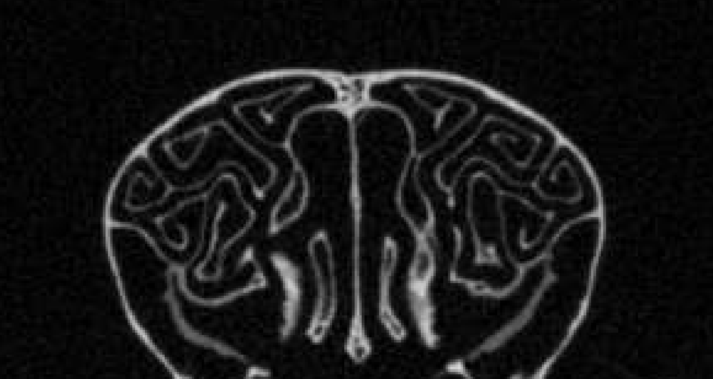
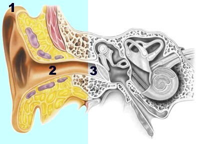
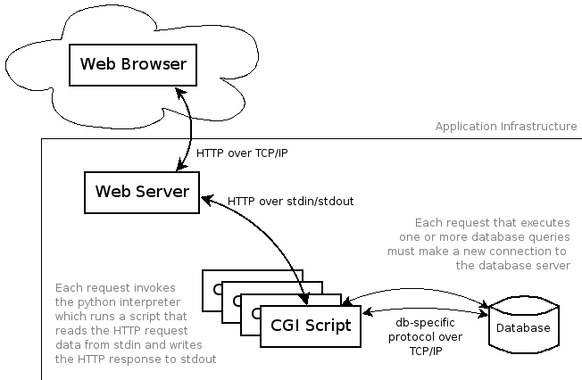
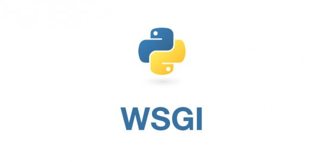

% LRD Upgrade
% Amir Salama; Davide Morgagni
% Biomedical Informatics, 2014

# LRD / LAR RUNNING DEMO

## What is LRD

LRD is a software that enables automatic model extraction from a set of medical images (like MRI). Such feature is achieved through a process in which a user gives input and other parameters to start the computation.
The whole software is based on the mathematical LAR framework and the OpenCL based framework "HPC LAR".

---

## Functioning of LRD

The current version of the LRD is composed of several modules that allow you to automatically extract all the possible models from a stack images (for example, from a magnetic resonance imaging). The input images must be in PNG, JPG or DCM. Executions can be controlled only from the command line. LRD will extract one of the possible models, and show it using one of the available viewers. Viewers supported are PyPlasm, MeshLav and Manta.

## Functioning of LRD

The extraction of the model takes place through a filter that transforms each image from a gray scale to a bitonal image, using an edge operator. In this way the bone tissue is identified and from these images is rendered 3D model.

## Defects

- Exclusive use from the command line

\begin{figure}[htbp]
        \centering
        \includegraphics[height=6cm, width=8cm, angle=0,
          keepaspectratio]{codice.png}
\end{figure}
\note{} 

## Defects

- Actual version of filter does not work well for some forms of bone

\begin{figure}[htbp]
        \centering
        \includegraphics[height=6cm, width=8cm, angle=0,
          keepaspectratio]{bone.png}
\end{figure}
\note{} 

# Upgrading LRD

## Improvements
<!-- titolo di una diapositiva-->

The new features of the software will be:

<!-- lista-->
- A new filter that is able to extract all types of bones
- Web interface to make the software easy to use

## Requirements of filter

- Able to extract the correct model in the presence of bones in hen

 \begin{figure}[htbp]
        \centering
        \includegraphics[height=6cm, width=8cm, angle=0,
          keepaspectratio]{orecchio.jpg}
        \caption{Internal structure of ear}
\end{figure}
\note{} 

-----

## Operation of Web Service

 \begin{figure}[htbp]
        \centering
        \includegraphics[height=8cm, width=10cm, angle=0,
          keepaspectratio]{cgi2.png}
        \caption{Web service operation}
\end{figure}
\note{} 

# Technologies

## Technologies

<!-- lista-->
- Back-end: Python
     + Framework (Django with WSGI)
- Front-end: CSS, HTML5

## Django

Django is a free and open source web application framework, written in Python, which follows the model–view–controller architectural pattern.
It provides a number of features that facilitate the rapid development of applications for managing content.
 \begin{figure}[htbp]
        \centering
        \includegraphics[height=6cm, width=8cm, angle=0,
          keepaspectratio]{django.png}
\end{figure}
\note{} 

## WSGI

The Web Server Gateway Interface is a specification for simple and universal interface between web servers and web applications or frameworks for the Python programming language.

 \begin{figure}[htbp]
        \centering
        \includegraphics[height=6cm, width=8cm, angle=0,
          keepaspectratio]{wsgi.jpg}
\end{figure}
\note{} 

## WSGI vs CGI
WSGI servers handle processing requests from the web server and deciding how to communicate those requests to an application framework's process. The segregation of responsibilities is important for efficiently scaling web traffic.
So WSGI is more scalable and flexible than CGI

## Evolution

The doctor will use the system to select the tac you want to display the 3D model. The web service starts the application and return the model to the browser.

## Roadmap of work

1. Search and selection of the best algorithms for image processing to implement a filter better than the current (Amir Salama / Davide Morgagni)
2. Filter implementation (Davide Morgagni)
3. Web service development (Amir Salama)
